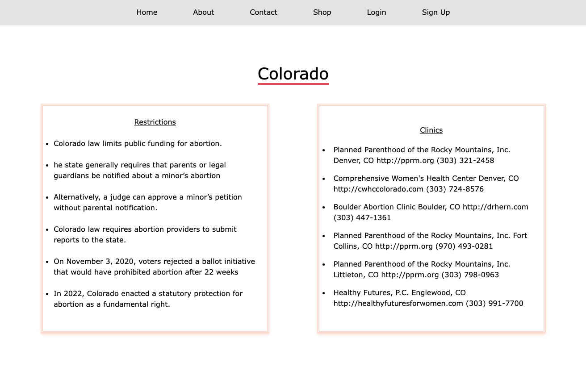
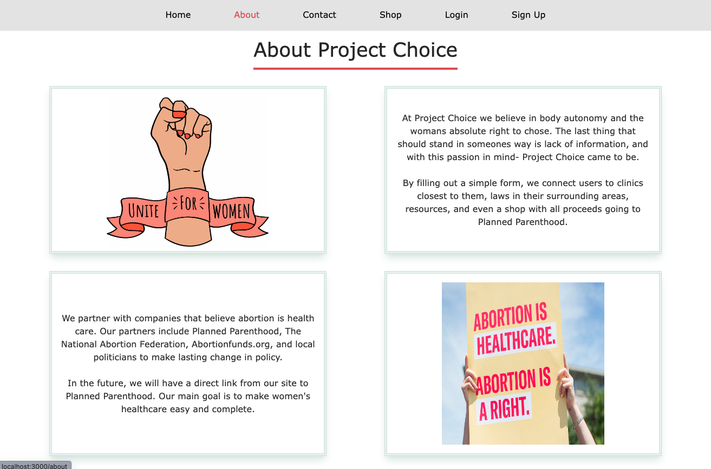
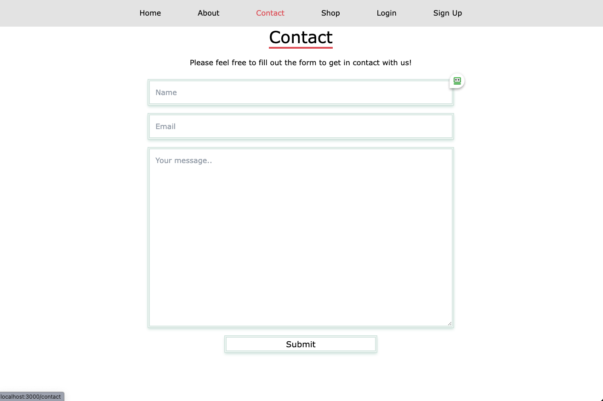
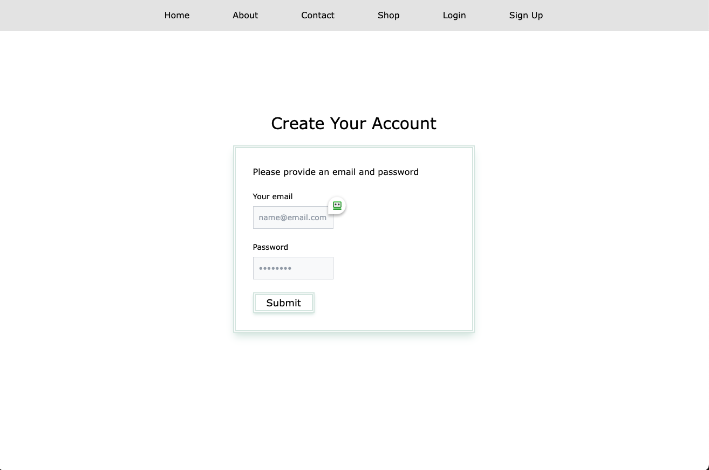
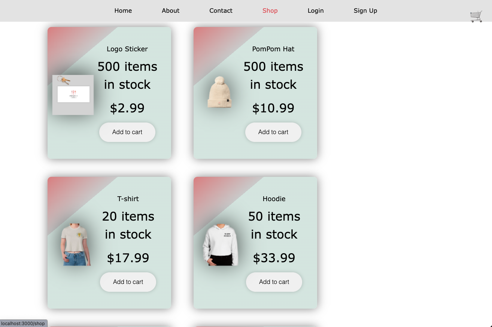

# Project Choice

Project Choice is a single page React Application that provides current information on Abortion Access by state.  There is a contact form to get more information and an online shop with branded products available for purchase.  All proceeds go the Planned Parenthood.


## Built with:


## Description:

With 3 non-personally-identifiable pieces of information (that we don’t collect or store), we’re able to give people seeking abortions the information most relevant to their individual circumstances. Our goal is to make it as easy as possible for people to find the information and resources that apply to them, without having to sift through a lot of noise or, worse, misinformation and stigma from anti-abortion organizations.

A fully functional version is available [here](https://project-choice.herokuapp.com/)

## Contents

- [Installation](#installation)
- [Usage](#usage)
- [Visuals](#visuals)
- [License](#license)
- [Contributing](#contributing)
- [Tests](#tests)
- [Questions](#questions)

## Installation

1. Clone the repo
   ```sh
   git clone git@github.com:JenniferByrnes/project-choice.git
   ```
2. Install all NPM packages
   ```sh
   npm install
   ```
3. Initiate application in the root of the application
   ```sh
   npm run develop
   ```

## Usage

The usage of our application is to provide a simple, up-to-date, and localized source of information for people seeking abortions and an online store that offers branded products for sale.

## Visuals








## License

This application is licensed under the MIT license.

## Contributing

Contributions are what make the open source community such an amazing place to learn, inspire, and create. Any contributions you make are welcome. If you have a suggestion that would make this better, please fork the repo and create a pull request.

1. Fork the Project
2. Create your Feature Branch (`git checkout -b feature/NewFeature`)
3. Commit your Changes (`git commit -m 'Add some NewFeature'`)
4. Push to the Branch (`git push origin feature/New`)
5. Open a Pull Request

## Tests

No tests.

## Questions?

Check out the creators's Github links here:

[Github Amanda Phillips](https://github.com/babaphillips)\
[Github Jennifer Byrnes](https://github.com/JenniferByrnes)\
[Github James Fraser](https://github.com/James-Fraser1)\
[Github Cortland Finch](https://github.com/cortlandfinch)\
[Github Christian Rockwood](https://github.com/rockwoodc)
